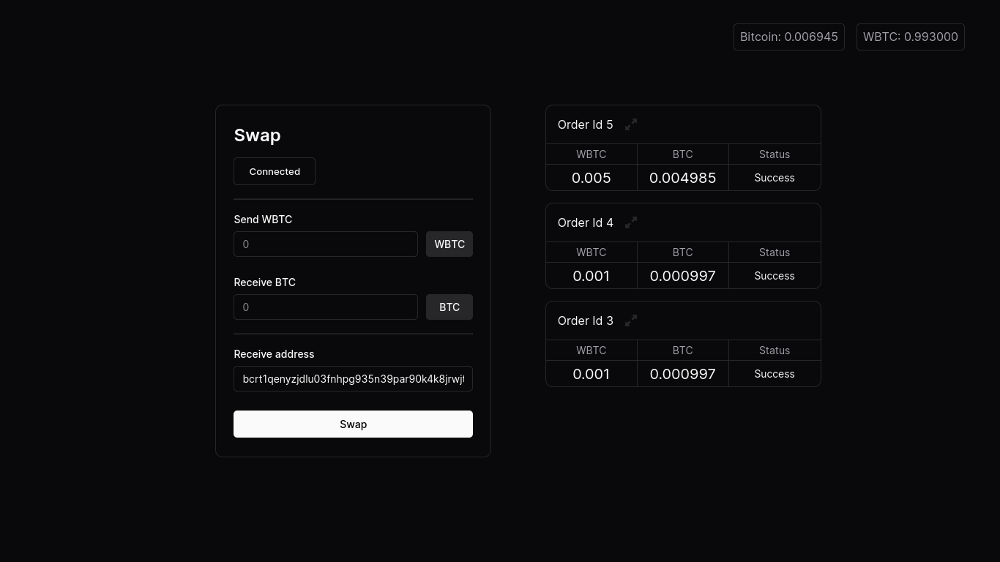
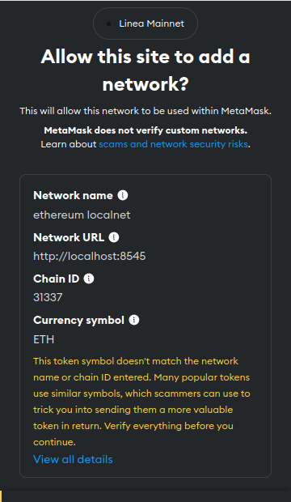
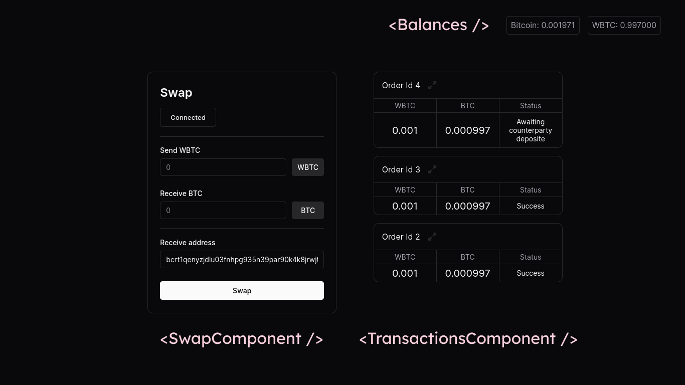
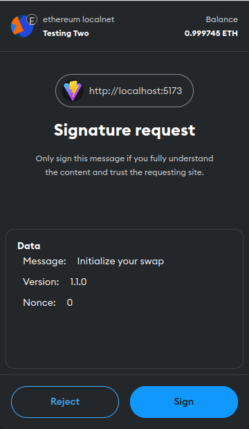
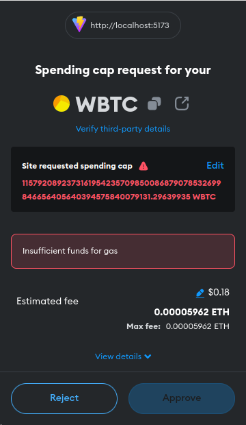

import Tabs from '@theme/Tabs';
import TabItem from '@theme/TabItem';

# Demo App

:::note
This guide accompanies the [gardenfi/demo-app](https://github.com/gardenfi/demo-app) and is intended solely for learning purposes, and not for production use.
:::


## Introduction

This guide demonstrates how to use the [Garden SDK](../developers/sdk/Sdk.md) to develop a basic dApp for swapping WBTC to BTC.

The user interface looks like this:



## Environment setup

To improve the developer experience, we will use [Merry](../developers/merry/Merry.md) to set up the multichain environment necessary for performing a swap. 

This setup includes all essential components, such as
- [Orderbook](../developers/fundamentals/orderbook/Orderbook.md)
- [Filler](../developers/fundamentals/filler/filler.md)
- [Faucet](https://www.alchemy.com/faucets#faucets-switchback-right-light)
- Bitcoin, Ethereum, and Arbitrum Nodes.

1. Install Merry

```bash
curl https://get.merry.dev | bash
```

2. Start Merry

<Tabs>
<TabItem value="with-explorer" label="with explorer" default>

```bash
merry go
```
</TabItem>

<TabItem value="without-explorer" label="without explorer">

```bash
merry go --headless
```
</TabItem>

</Tabs>

3. Fund your EVM address

```bash
 merry faucet --to <EVM Address>
```

## Project setup

Let's create a react app using the following command. If you don't have Bun installed, please refer to [bun](https://bun.sh/).

```bash
# Creates a react-app using vite
bun create vite demo-app --template react-ts
```

## Installing dependencies

The following dependencies are needed to build the dApp.

```bash
# Installs Garden SDK
bun add @catalogfi/wallets @gardenfi/orderbook @gardenfi/core ethers@6.8.0

# Install Zustand
bun add zustand
```

## Installing development dependencies

We need to include the `vite-plugin-wasm`, `vite-plugin-node-polyfills`, and `vite-plugin-top-level-await` dependencies to enable SDK functionality on the frontend:

```bash
bun add -D \
  vite-plugin-wasm \
  vite-plugin-node-polyfills \
  vite-plugin-top-level-await
```

Next, update the Vite configuration as follows:

```ts title="/vite.config.ts"
import { defineConfig } from 'vite';
import react from '@vitejs/plugin-react';
// highlight-start
import wasm from 'vite-plugin-wasm';
import { nodePolyfills } from 'vite-plugin-node-polyfills';
import topLevelAwait from 'vite-plugin-top-level-await';
// highlight-end

// https://vitejs.dev/config/
export default defineConfig({
// highlight-next-line
  plugins: [react(), wasm(), nodePolyfills(), topLevelAwait()],
});
```

Now we are all set to build the dApp.

## The dApp

The [SDK Guide](../developers/sdk/sdk-guides/SdkGuides.md) covers the creation of a [`Garden` instance](../developers/sdk/sdk-guides/SwappingBtcWbtc.md#swapping) and its usage for swaps and other operations. We'll do the same here by creating a custom hook to handle the Garden instance creation.

:::note
For state management, we are using [Zustand](https://zustand-demo.pmnd.rs/), which minimizes boilerplate and offers a user-friendly approach to managing state. If you're new to Zustand, please review the [Zustand documentation](https://docs.pmnd.rs/zustand/getting-started/introduction).
:::

### useGarden hook

```tsx title="/src/store.tsx"
import { GardenJS } from '@gardenfi/core';
import { create } from 'zustand';

type GardenStore = {
  garden: GardenJS | null;
  bitcoin: BitcoinOTA | null;
  setGarden: (garden: GardenJS, bitcoin: BitcoinOTA) => void;
};

const gardenStore = create<GardenStore>((set) => ({
  garden: null,
  bitcoin: null,
  setGarden: (garden: GardenJS, bitcoin: BitcoinOTA) => {
    set(() => ({
      garden,
      bitcoin,
    }));
  },
}));

const useGarden = () => ({
  garden: gardenStore((state) => state.garden),
  bitcoin: gardenStore((state) => state.bitcoin),
});
```

`useGarden` returns both a Garden instance and a BitcoinOTA instance. The Garden instance allows you to create swaps or subscribe to orders, while the BitcoinOTA instance enables interactions with the Bitcoin wallet.

Next, let's create a hook that sets the Garden instance.

```tsx title="/src/store.tsx"
// `useGardenSetup` has to be called at the root level only once
const useGardenSetup = () => {
// this could also be useWeb3React (a type of browserProvider from ethers)
  const { evmProvider } = useMetaMaskStore();
  const { setGarden } = gardenStore();

  useEffect(() => {
    (async () => {
      if (!evmProvider) return;
      const signer = await evmProvider.getSigner();

      const bitcoinProvider = new BitcoinProvider(
        BitcoinNetwork.Regtest,
        "http://localhost:30000"
      );

      const orderbook = await Orderbook.init({
        url: "http://localhost:8080",
        signer: signer,
        opts: {
          // eslint-disable-next-line @typescript-eslint/no-explicit-any
          domain: (window as any).location.host,
          store: localStorage,
        },
      });

      const wallets = {
// highlight-next-line
        [Chains.bitcoin_regtest]: new BitcoinOTA(bitcoinProvider, signer),
        [Chains.ethereum_localnet]: new EVMWallet(signer),
      };

      const garden = new GardenJS(orderbook, wallets);

// highlight-next-line
      setGarden(garden, wallets[Chains.bitcoin_regtest]);
    })();
  }, [evmProvider, setGarden]);
};
```

- `useGardenSetup` initializes the Garden instance and updates it in the state whenever the EVM provider (from MetaMask or another Web3 provider) changes. This hook should be called once at the root level of your application (eg. `src/App.tsx`). It ensures that the Garden instance, along with the required Bitcoin and Ethereum wallets, is properly configured and accessible throughout the dApp.

- The `BitcoinOTA` instance is instantiated using the `bitcoinProvider` and the `signer` obtained from the `evmProvider`. By utilizing the `signer` provided by the `evmProvider`, the `BitcoinOTA` address remains consistent with the corresponding EVM address.

For more on creation of wallets you can refer to [Creating Wallets](../developers/sdk/sdk-guides/CreatingWallets.md).

### useMetaMaskStore hook

``` tsx title="/src/store.tsx"
import { BrowserProvider } from "ethers";

type EvmWalletState = {
  metaMaskIsConnected: boolean;
  evmProvider: BrowserProvider | null;
};

type EvmWalletAction = {
  connectMetaMask: () => Promise<void>;
};

const networkConfig = {
  chainId: "0x7A69",
  chainName: "ethereum localnet",
  rpcUrls: ["http://localhost:8545"],
  nativeCurrency: {
    name: "Ethereum",
    symbol: "ETH",
    decimals: 18,
  },
};

const useMetaMaskStore = create<EvmWalletState & EvmWalletAction>((set) => ({
  metaMaskIsConnected: false,
  evmProvider: null,
  connectMetaMask: async () => {
    if (window.ethereum !== null) {
      let provider = new BrowserProvider(window.ethereum);
      let network = await provider.getNetwork();

//highlight-start
      if (network.chainId !== 31337n) {
        await window.ethereum.request({
          method: "wallet_addEthereumChain",
          params: [networkConfig],
        });
        provider = new BrowserProvider(window.ethereum);
      }
//highlight-end

      set(() => ({
        evmProvider: provider,
        metaMaskIsConnected: true,
      }));
    } else {
      throw new Error("MetaMask not Found");
    }
  },
}));
```

- The `networkConfig` object specifies the details of the Ethereum network to connect to (in our case, the localnet), including chain ID, chain name, RPC URLs, and native currency details.
- The highlighted logic checks if the connected network's chain ID is not 31337 (the local Ethereum network). If it isn't, the function requests MetaMask to add the specified Ethereum chain from `networkConfig`.



## Root component

```tsx title="/src/App.tsx"
import SwapComponent from "./SwapComponent";
import TransactionsComponent from "./TransactionComponent";
import Balances from "./Balances";
import { useGardenSetup } from "./store";
import "./App.css";

function App() {
// highlight-next-line
  useGardenSetup();
  return (
    <div id="container">
// highlight-start
      <Balances />
      <SwapComponent></SwapComponent>
      <TransactionsComponent></TransactionsComponent>
// highlight-end
    </div>
  );
}

export default App;
```

- The `Balances` component displays the BTC & WBTC balances of the user's wallets. 
- The `SwapComponent` handles the logic for the swap screen, allowing users to input amounts and initiate the swap. 
- The `TransactionsComponent` is responsible for fetching the latest transactions of the currently active EVM account.
- Additionally, `App` calls the `useGardenSetup` hook, which sets up the Garden instance and the BitcoinOTA.



:::note
We haven't used Tailwind CSS or any other CSS library, and discussing CSS specifics for the app is outside the scope of this guide. However, you can find all the CSS code on [demo-app/css](https://github.com/gardenfi/demo-app/blob/main/src/App.css).
:::

## Balances component

```tsx title="/src/Balances.tsx"
const Balances: React.FC = () => {
  const { bitcoin } = useGarden();
  const { evmProvider } = useMetaMaskStore();
  const [bitcoinBalance, setBitcoinBalance] = useState("0");
  const [wbtcBalance, setWBTCBalance] = useState("0");
  const { isMMPopupOpen, isSigned, setIsSigned, setIsMMPopupOpen } = useSignStore();

  const fetchBalance = useCallback(async () => {
  /*
  `fetchBalance` logic discussed later 
  */
  }, [bitcoin, evmProvider, isMMPopupOpen]);


  // Updates the balances every 10sec
  useEffect(() => {
    const id = setInterval(() => {
      fetchBalance();
    }, 10000);

    return () => {
      clearInterval(id);
    };
  }, [fetchBalance]);

  // Updates the balances on the first render 
  useEffect(() => {
    fetchBalance();
  }, [fetchBalance]);

  return (
    <div className="balances">
      <p>Bitcoin: {bitcoinBalance}</p>
      <p>WBTC: {wbtcBalance}</p>
    </div>
  );
};
```

The `Balances` component fetches and displays the user's Bitcoin (BTC) and Wrapped Bitcoin (WBTC) balances using `useGarden` and `useMetaMaskStore` hooks. It manages state for the balances, MetaMask popup visibility, and user sign-in status. 

```tsx
const fetchBalance = useCallback(async () => {
  if (!bitcoin || !evmProvider) return;
  if (isMMPopupOpen && !isSigned) return;

  let balance = 0;
  try {
    if (!isSigned) setIsMMPopupOpen(true);
    // highlight-next-line
    balance = await bitcoin.getBalance();
    setIsSigned(true);
    setIsMMPopupOpen(false);
    setBitcoinBalance(Number(formatUnits(balance, 8)).toFixed(6));

    const erc20 = new Contract(
      "0x5FbDB2315678afecb367f032d93F642f64180aa3",
      ERC20ABI,
      evmProvider
    );
    const signer = await evmProvider.getSigner();
    const address = await signer.getAddress();
    const wbtcBalance = await erc20.balanceOf(address);
    setWBTCBalance(Number(formatUnits(wbtcBalance, 8)).toFixed(6));
  } catch (err) {
    setIsSigned(false);
    setIsMMPopupOpen(false);
  }
}, [
  bitcoin,
  evmProvider,
  isMMPopupOpen,
  isSigned,
  setIsSigned,
  setIsMMPopupOpen,
]);
```

- As previously discussed in the [useGardern Hook](/cookbook/demo-app#usegarden-hook) section, the `BitcoinOTA` instance is instantiated using the `signer` provided by the `evmProvider` (which is MetaMask in our case). Consequently, the popup prompts us to authorize the signer. 
- The exact moment that tiggers the MetaMask popup is the `await bitcoin.getBalance()` line, highlighted above.
- The remaining logic manages two distinct states: one controls the MetaMask popup (`setIsMMPopupOpen`), while the other tracks whether the signer has been authorized (`isSigned`). If the request hasn't been signed and the popup is closed, it will open automatically (initiated by `bitcoin.getBalance`, which requires the signer). Once the transaction is signed, the popup remains closed for subsequent balance retrievals.



## SwapComponent

```tsx title="/src/SwapComponent.tsx"
import { useState } from 'react';

const SwapComponent: React.FC = () => {
  const [amount, setAmount] = useState<AmountState>({
    btcAmount: null,
    wbtcAmount: null,
  });

  const changeAmount = (of: "WBTC" | "BTC", value: string) => {
    if (of === "WBTC") {
      handleWBTCChange(value);
    }
  };
  const handleWBTCChange = (value: string) => {
    const newAmount: AmountState = { wbtcAmount: value, btcAmount: null };
    if (Number(value) > 0) {
      const btcAmount = (1 - 0.3 / 100) * Number(value);
      newAmount.btcAmount = btcAmount.toFixed(8).toString();
    }
    setAmount(newAmount);
  };

  return (
    <div className="swap-component">
      <WalletConnect />
      <hr></hr>
      <SwapAmount amount={amount} changeAmount={changeAmount} />
      <hr></hr>
      <Swap amount={amount} changeAmount={changeAmount} />
    </div>
  );
};
```

- `WalletConnect` manages the logic for connecting to MetaMask. 
- `SwapAmount` handles the logic for inputting amounts. 
- `Swap` manages addresses and the actual swapping process. 

Let's examine the `Swap` component.

```tsx title="/src/SwapComponent.tsx"
import { Assets } from '@gardenfi/orderbook';

type SwapAndAddressComponentProps = {
  amount: AmountState;
  changeAmount: (of: "WBTC" | "BTC", value: string) => void;
};

const Swap: React.FC<SwapAndAddressComponentProps> = ({
  amount,
  changeAmount,
}) => {
  const { garden, bitcoin } = useGarden();
  const [btcAddress, setBtcAddress] = useState<string>();
  const { metaMaskIsConnected } = useMetaMaskStore();
  const { wbtcAmount, btcAmount } = amount;

  useEffect(() => {
    if (!bitcoin) return;
    const getAddress = async () => {
      const address = await bitcoin.getAddress();
      setBtcAddress(address);
    };
    getAddress();
  }, [bitcoin]);

// highlight-start
  const handleSwap = async () => {
    if (
      !garden ||
      typeof Number(wbtcAmount) !== "number" ||
      typeof Number(btcAmount) !== "number"
    )
      return;

    const sendAmount = Number(wbtcAmount) * 1e8;
    const recieveAmount = Number(btcAmount) * 1e8;

    changeAmount("WBTC", "");

    await garden.swap(
      Assets.ethereum_localnet.WBTC,
      Assets.bitcoin_regtest.BTC,
      sendAmount,
      recieveAmount
    );
  };
// highlight-end

  return (
    <div className="swap-component-bottom-section">
      <div>
        <label htmlFor="receive-address">Receive address</label>
        <div className="input-component">
          <input
            id="receive-address"
            placeholder="Enter BTC Address"
            value={btcAddress ? btcAddress : ""}
            onChange={(e) => setBtcAddress(e.target.value)}
          />
        </div>
      </div>
      <button
        className={`button-${metaMaskIsConnected ? "white" : "black"}`}
        onClick={handleSwap}
        disabled={!metaMaskIsConnected}
      >
        Swap
      </button>
    </div>
  );
};
```

The core logic we want to highlight is encapsulated in the `handleSwap` function. It uses `garden.swap` to carry out the swap operation by utilizing the specified assets and amounts. Here's a more detailed breakdown of how this works:

```tsx
const handleSwap = async () => {
  if (
    !garden ||
    typeof Number(wbtcAmount) !== "number" ||
    typeof Number(btcAmount) !== "number"
  )
    return;

  const sendAmount = Number(wbtcAmount) * 1e8; // Convert WBTC to satoshi
  const receiveAmount = Number(btcAmount) * 1e8; // Convert BTC to satoshi

  changeAmount("WBTC", ""); // Clear WBTC input

  await garden.swap(
    Assets.ethereum_localnet.WBTC, // Source asset
    Assets.bitcoin_regtest.BTC,    // Destination asset
    sendAmount,                    // Amount to send
    receiveAmount                  // Amount to receive
  );
};
```


## Transactions component

```tsx title="/src/TransactionsComponent.tsx"
import { Actions, Order as OrderbookOrder } from '@gardenfi/orderbook';

function TransactionsComponent() {
  const { garden } = useGarden();
  const { evmProvider } = useMetaMaskStore();
  const [orders, setOrders] = useState(new Map<number, OrderbookOrder>());

  useEffect(() => {
    const fetchOrders = async () => {
      if (!garden || !evmProvider) return;

      const signer = await evmProvider.getSigner();
      const evmAddress = await signer.getAddress();

      if (!evmAddress) return;

// highlight-start
      garden.subscribeOrders(evmAddress, (updatedOrders) => {
        setOrders((prevOrders) => {
          const updatedOrdersMap = new Map(prevOrders);
          updatedOrders?.forEach((order) =>
            updatedOrdersMap.set(order.ID, order)
          );
          return updatedOrdersMap;
        });
      });
    };
//highlight-end

    fetchOrders();
  }, [garden, evmProvider]);

  const recentOrders = Array.from(orders.values())
    .sort((a, b) => b.ID - a.ID)
    .slice(0, 3);

  if (!recentOrders.length) return null;

  return (
    <div className="transaction-component">
      {recentOrders.map((order) => (
        <OrderComponent order={order} key={order.ID} />
      ))}
    </div>
  );
}
```

`garden.subscribeOrders` establishes a socket connection with the Orderbook backend which is running on [`http://localhost:8080`](http://localhost:8080). 

:::note
Orderbook fetches **all** orders initially and **only** updated-orders on subsequent requests. 
:::


Now, performing actions on orders is straightforward.

```ts
const swapper = garden.getSwap(order);
const performedAction = await swapper.next();
```

`swapper.next()` advances the swap process to the next [state](../developers/fundamentals/orderbook/Orderbook.md#order-status). If you've created an order, `.next()` will initiate it by depositing funds. Once the counter-party initiates, calling `.next` will redeem the funds on the destination chain. To determine when to perform what action, we parse the order status using the `parseStatus` method.

```ts
import { Actions, parseStatus } from '@gardenfi/orderbook';

const parsedStatus = parseStatus(order);
// parsedStatus could be one of these (UserCanInitiate, UserCanRedeem, UserCanRefund etc.)
```

## Troubleshooting

### Insufficient funds for gas



To resolve this issue, you can fund your EVM address using Merry with the following command

```bash
merry faucet --to <EVM Address>
```
This will provide the necessary funds to cover gas fees. Please wait 10 seconds for the EVM balance to update on the frontend.

### Unable to initiate swap

This can happen for two reasons: either the sending cap request hasn't been approved (you can verify this by checking the Activity section of MetaMask, where it will appear as the first request), or there is a mismatch between the localnet Merry and MetaMask due to issues such as Merry's chain data being lost or deleted.

In both scenarios, follow these steps:
1. Clear MetaMask
- Ensure the localnet network is selected.
- Click on the three-dot menu, then go to Settings > Advanced > Clear Activity Tab Data.

2. Restart Merry

Use the following commands:

```bash
merry stop --delete
sudo rm -rf ~/.merry
merry start
```

Checkout full code for Demo-App [here](https://github.com/gardenfi/demo-app).
