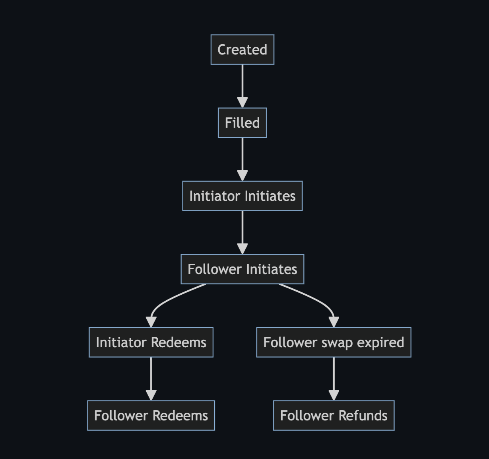
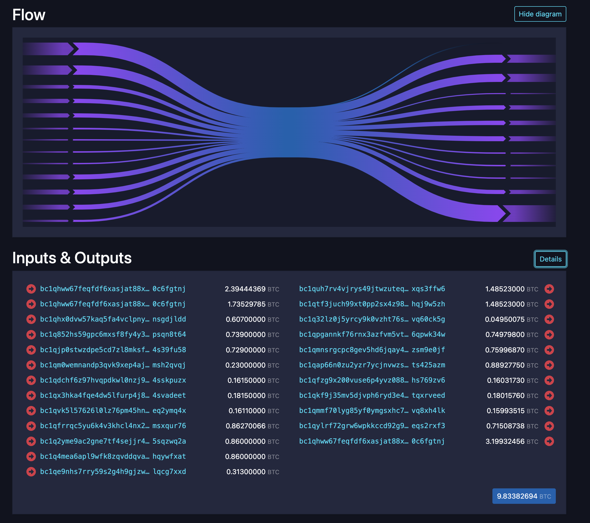

# COBi

COBi is an automated trading system designed to contribute liquidity to the garden orderbook AMM. It can be deployed on a server and left to run indefinitely, fulfilling the role of a filler by fetching and filling orders from the Catalog orderbook at the best possible price according to a configurable strategy.

## Key Features

1. **Order Fetching and Filling**:
COBi continuously monitors the garden orderbook for open orders that match its configured strategy. When it identifies an order that meets the criteria, it fills the order at the best possible price. This process ensures liquidity in the orderbook and helps maintain market efficiency.

1. **Configurable Filling Strategy**:
Strategies define the conditions under which COBi fills an order. These conditions include the asset pairs to trade, the minimum and maximum amounts, and the fees involved. By executing these strategies, COBi optimizes the trading process, ensuring that orders are filled in a way that maximizes benefits for both the user and the system.

1. **Swap Execution**:
Once an order is filled, COBi executes the swap on-chain using the atomic swap protocol. This ensures that the trade is completed securely and efficiently, with minimal risk of errors or delays. By automating this process, COBi streamlines the trading experience for users and helps diversify the system's liquidity.

1. **Gas Optimization**:
COBi uses advanced gas estimation techniques to ensure that transactions are confirmed quickly and at the lowest possible cost. This optimization is critical in maintaining the system's efficiency and reducing the overall transaction costs of execution.

1. **Delegator Rewards**:
Operators with a filler role in the garden staking system and ensure that all voters of a filler receive a portion of the trading fees generated by the filler. This provides more users to tap into the rewards generated by the trading activity on the orderbook, enhancing the filler's overall credibility and sustainability.

## How does COBi enable swaps?

COBi performs certain actions to enable swaps on the garden orderbook. The following diagram illustrates the process of enabling swaps using COBi:

#### Ethereum Executor
 The swap details and next action are passed to the executor which interacts with the contract to execute the swap.Ethereum wallet contains the methods to interact with the HTLC contract.

#### Bitcoin Executor
  Bitcoin executor gets all the active orders every fixed duration to batch all the actions into a single transaction. It is ensured that a single transaction will be included in the next block by performing RBF if the latest transaction is not confirmed and carries lower fees that projected fees.  Execution of multiple swaps in a single transaction is done by creating a transaction with multiple inputs and outputs.

- **Example:** The following image shows how multiple utxos are batched together to provide liquidity to multiple initiates in a single transaction.

  - Find transaction on [mempool.space](https://mempool.space/tx/4d6558e383eafc9599cde547c1fa8d9f61d8532348f90f13e7a040e12b413972)

## Who can use COBi?

Anyone with a filler role in the garden staking system can maintain COBi. As a filler, COBi plays a crucial role in the garden ecosystem by ensuring that the orderbook is always ready to fill orders quickly and ensure the trading process is successful. Fillers are authenticated by the orderbook AMM and will be set to compete in an auction to fill orders. The filler with the best price will be selected to fill and initiate the trade.

One can become a filler by staking 210,000 $SEED tokens in the garden staking system. The staking system is a governance system that allows users to stake $SEED tokens to participate in the staking of the garden ecosystem. The staking system also allows users to earn rewards for staking their tokens by electing a filler. All the voters of a filler will receive a portion of the trading fees generated by the filler proportionate to the number of votes they have cast for the filler.
  
*More about staking and governance can be found in the [staking blog post](https://garden.finance/blogs/staking-is-live/).*

### Market Making Auctions

The garden ecosystem also houses a auction mechanism which is a process that allows fillers to compete for their right to fill an order. The auction is initiated when an order is placed in the orderbook. Fillers submit their bids to fill the order, and the orderbook AMM selects the best bid based on the price and other criteria. The selected filler then fills the order and initiates the trade.

Orderbook acts as the auctioneer and selects the best filler based on the following criteria:

- **Price:** The filler with the best price is selected to fill the order.
- **Number of votes in the staking system:** The filler with the most votes in the staking system is prioritized.
- **Reputation Score:** The filler's reputation score is calculated based on their past performance and success rate in completing trades.
  
*More about market making can be found in the [market making blog post](https://garden.finance/blogs/market-making-and-staking/).*

## How to deploy COBi?

COBi can be deployed on a server using the provided Docker image. The Docker image contains all the necessary dependencies and configurations to run COBi smoothly. To deploy COBi, refer to the [COBi Setup](https://github.com/catalogfi/cobi/tree/feat/readme?tab=readme-ov-file#setup)

## Fees and APY

Fees in the swaps are generated by the filler by increasing the price of the order. Price is the ratio in tokens in maker request to filler offer. The filler can set the price to be higher or lower based the demand(pressure) in the swap direction or to gae the system. The difference between the price set by the filler and the current market price is the fee.

Garden ecosystem also allows the makers to pay in $SEED tokens to reduce the fee. The $SEED tokens are atomically redeemed by COBi if the swap is successful.

