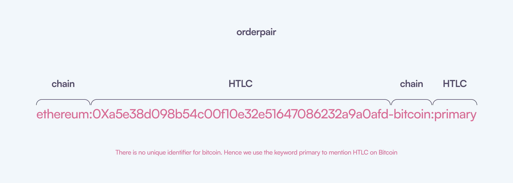

# Orderbook

At the core of the Garden lies the Orderbook. It is responsible for order creation, matching, and settlement. One can create orders, track their status, and securely settle them using [Atomic Swaps](../../../home/basics/swap/AtomicSwaps.md).

## Terminology

This section defines key terms you'll encounter when working with the Orderbook:

- **Maker:** The party who creates the order. Also known as the initiator.

- **Taker:** The party who fulfills a maker's order. Also known as the follower.

- **Filler:** A bot specifically designed to efficiently manage order fulfillment and settlement within the Orderbook system.

- **Confirmations:** The number of blocks that need to be mined after a transaction is made. This is to ensure that the transaction is valid and secure. Orderbook uses one confirmation for Bitcoin and 6 confirmations for EVM based chains.

We use these terms in the next sections to refer to the participants in the Orderbook.

## Creating Orders

**Makers** initiate orders on the Orderbook by submitting an **OrderRequest**. This request specifies the following details:

- **Orderpair:** The assets to be exchanged (e.g., BTC for WBTC).
- **Amounts:** The quantity of each asset involved in the trade (e.g., 0.1 BTC and 0.097 WBTC).
- **Fee:** The amount the maker is willing to pay for order execution.
- **Additional Parameters:** Refer to the dedicated [API](../../orderbook-api/OrderbookAPI.md#create-order) section for details on other configurable options.

Once submitted, the Orderbook engine broadcasts the OrderRequest to all **Fillers**. Fillers can then evaluate the offer based on their matching strategies. An order will only be matched if a Filler identifies it as a profitable opportunity.

### Orderpair

In Orderbook, an orderpair notation specifies the source and destination chains along with their assets. It consists of two identifiers combined with a dash ('-'), where each identifier includes the chain name and the atomic swap contract address separated by a colon (:). If it is Bitcoin chain, the keyword `primary` is used instead of the contract address.

Every atomic swap contract has a fixed ERC20 token. This token is used to identify the assets being traded.

Example:
For a trade from WBTC on Ethereum to BTC on Bitcoin, the order pair is:
`ethereum:0xa5e38d098b54c00f10e32e51647086232a9a0afd-bitcoin:primary`.

The contract `0xa5e38d098b54c00f10e32e51647086232a9a0afd` supports WBTC on Ethereum. Hence Orderbook parses this orderpair as WBTC on Ethereum to BTC on Bitcoin.

You can get all the supported chains and their contract addresses [here](../../orderbook-api/OrderbookAPI.md#assets).

## Matching Orders

Orders are matched based on strategies implemented by the Fillers. A simple strategy could be to match an order which has minimum of 0.3% fee.
Fillers are participants who fulfill makers' orders by taking the opposite side of the trade. When a Filler finds an order that aligns with their strategy, they can accept it, and complete the transaction.

The Filler is a tool designed to efficiently manage order fulfillment and settlement within the Orderbook system.

More on [Fillers](../filler/filler.md)

## Settling Orders

:::note
We recommend you to read the [Atomic Swaps](../../../home/basics/swap/AtomicSwaps.md) section to understand how atomic swaps work. In Garden, atomic swaps are used to settle orders securely.
:::

The process of settling orders along with creation and matching is as follows:

1. **Order Creation:** Makers create orders specifying the amount of BTC they wish to exchange for WBTC, or vice versa.
2. **Order Matching:** Fillers match orders based on price and quantity (strategies), ensuring optimal trades.
3. **Swap Execution:** Once the order is matched, the swap execution process begins. The maker has to deposit funds into a HTLC. This is also called **Initiating** the swap and the transaction that maker makes to deposit funds into the HTLC is called **Initiation Transaction**. This transaction could take place in either Bitcoin or Ethereum blockchain based on assets being swapped. After certain confirmations, the swap is said to be initiated. This is when the counterparty initiates from their side.
4. **Settlement:** After both parties have initiated the swap, they can redeem the funds. This is called **Claiming** or **Redeeming** the swap. The maker redeems the funds from the HTLC by revealing the secret. This is typically done by submitting a transaction on respective blockchain. Counterparty does the same by taking the revealed secret from the maker.

## Tracking Orders

Order tracking allows makers and Fillers to monitor their order statuses and perform required actions based on the current status of the order.

### Order Status

Every order has a `status` field, a number, which indicates the current status of the order. This status is updated as the order progresses. Orderbook orders have the following statuses:

| Status | Description      |
| ------ | ---------------- |
| 1      | Created          |
| 2      | Matched          |
| 3      | Settled          |
| 4      | Order SoftFailed |
| 5      | Order HardFailed |
| 6      | Order Cancelled  |

- **Created:** Order is created by the maker.
- **Matched:** Order is matched by the Filler.
- **Settled:** Order is settled by both parties.
- **SoftFailed:** Order is said to be soft failed when one or both the parties have initiated the swaps but refunded after the expiry time.
- **HardFailed:** An **impossible** scenario, where one party has initiated, redeemed and refunded the swap resulting in a loss for the other party.
- **Cancelled:** Order is cancelled by Orderbook because it is not matched within a certain time. Right now, this is 3 minutes. Every order has a timeout of 3 minutes. After that, it is cancelled by the Orderbook.

The settlement process is a bit more complex. Let's take a look at it in detail.

### Atomic Swap Status

Every order has two HTLCs, one for each party. `initiatorAtomicSwap` field specifies the information about initiator's HTLC and `followerAtomicSwap` field specifies the information about Filler's HTLC.
More on this is explained in the [Atomic Swaps](../../../home/basics/swap/AtomicSwaps.md) section. A brief overview is given below:

1. **Initiator Atomic Swap:** A HTLC, where the maker deposits the funds and Filler redeems it.
2. **Follower Atomic Swap:** A HTLC, where the Filler deposits the funds and maker redeems it.

Each swap contains a field called `swapStatus` which indicates the status of the swap.

| SwapStatus | Description         |
| ---------- | ------------------- |
| 0          | Idle                |
| 1          | Initiation Detected |
| 2          | Initiated           |
| 3          | Expired             |
| 4          | Redeem Detected     |
| 5          | Refund Detected     |
| 6          | Redeemed            |
| 7          | Refunded            |

- **Idle:** Swap is not started yet.
- **Initiation Detected:** Funds are deposited into the HTLC but not yet confirmed.
- **Initiated:** Funds are deposited into the HTLC and confirmed.
- **Expired:** Swap is expired because the funds are not redeemed within the expiry time. This is typically 48 hours for maker and 24 hours for Filler.
- **Redeem Detected:** Funds are redeemed from the HTLC but not yet confirmed.
- **Refund Detected:** Funds are refunded from the HTLC but not yet confirmed.
- **Redeemed:** Funds are redeemed from the HTLC and confirmed.
- **Refunded:** Funds are refunded from the HTLC and confirmed.

Let's combine the statuses to get a global status of the order:

| Order Status | Initiator Atomic Swap Status | Follower Atomic Swap Status | Description                      |
| ------------ | ---------------------------- | --------------------------- | -------------------------------- |
| 1            | 0                            | 0                           | Created                          |
| 2            | 0                            | 0                           | Matched                          |
| 2            | 1                            | 0                           | Initiator Initiate Detected      |
| 2            | 2                            | 0                           | Initiator Initiated              |
| 2            | 3                            | x                           | Initiator Expired                |
| 2            | 2                            | 1                           | Follower Initiate Detected       |
| 2            | 2                            | 2                           | Follower Initiated               |
| 2            | x                            | 3                           | Follower Expired                 |
| 2            | 4                            | 2                           | Initiator Redeem Detected        |
| 2            | 4                            | 4                           | Follower Redeem Detected         |
| 3            | 6                            | 6                           | Settled (Both redeems confirmed) |
| 2            | 5                            | x                           | Initiator Refund Detected        |
| 2            | x                            | 5                           | Follower Refund Detected         |
| 4            | x                            | x                           | Order SoftFailed                 |
| 5            | 7                            | 6                           | Order HardFailed                 |
| 5            | 6                            | 7                           | Order HardFailed                 |
| 6            | 0                            | 0                           | Order Cancelled                  |

:::note
`x` here means status could be anything.
:::

## Supported chains

Orderbook supports the following chains:

| Chain    | Contract Address                             |
| -------- | -------------------------------------------- |
| Bitcoin  | `-`                                          |
| Ethereum | `0xA5E38d098b54C00F10e32E51647086232a9A0afD` |
| Arbitrum | `0xa0fed4a95adfb0faec4c4c7e1babbdf2405c38de` |

Bitcoin works differently. We can not create a smart contract as we do in Ethereum and use that for atomic swaps. Instead, we use scripts to create HTLCs. These scripts on generated on demand and are unique for every swap.

### Links to contracts:

- [Ethereum](https://etherscan.io/address/0xA5E38d098b54C00F10e32E51647086232a9A0afD)
- [Arbitrum](https://arbiscan.io/address/0xa0fed4a95adfb0faec4c4c7e1babbdf2405c38de)
