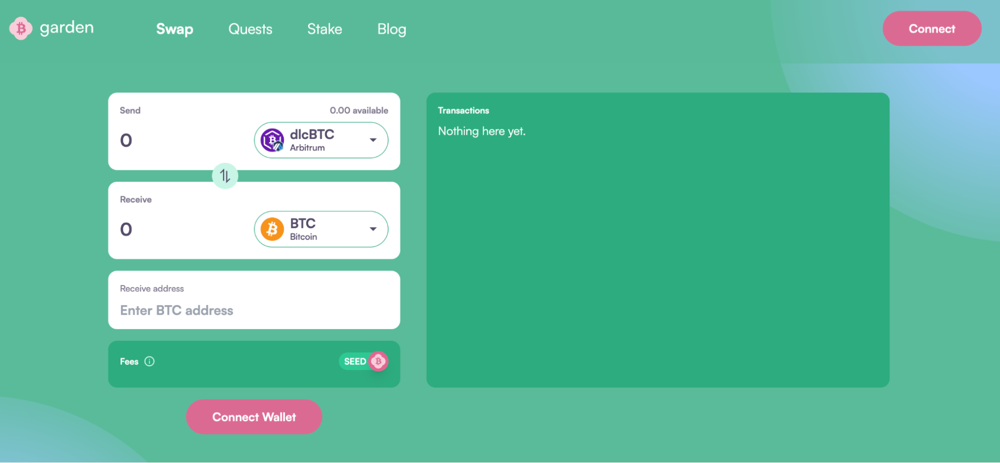
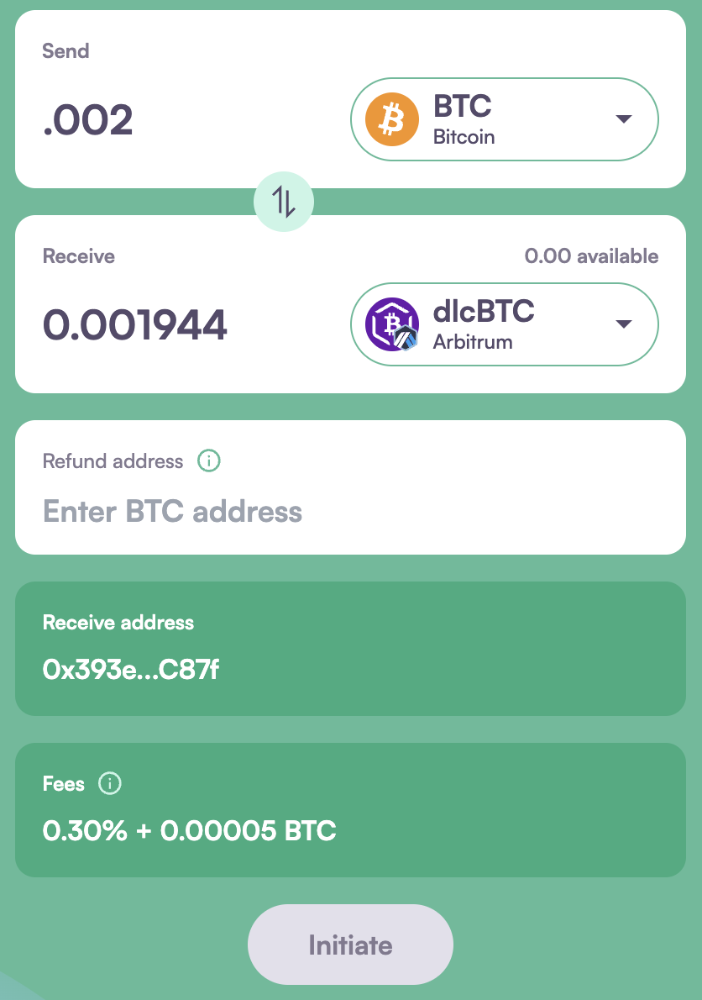
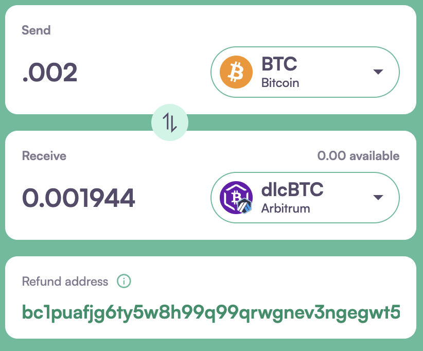
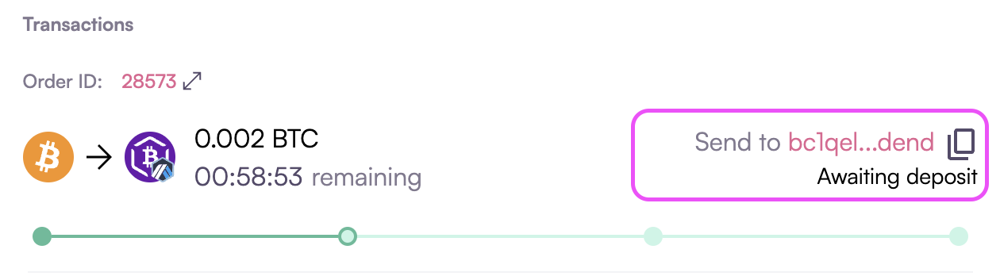
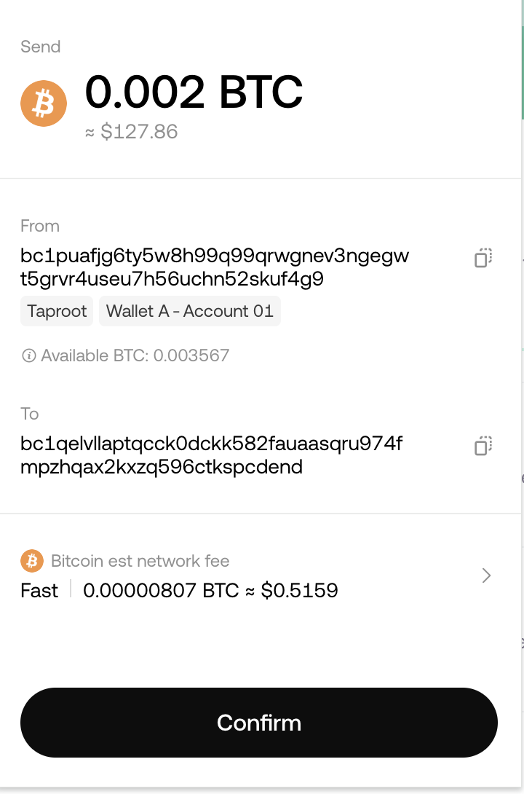
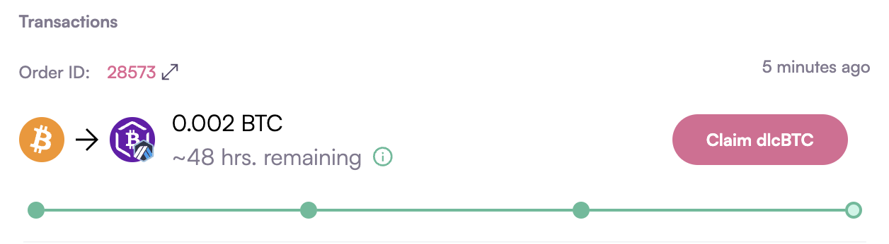

# How to swap BTC to dlcBTC

1. Go to garden.finance and click on the Swap tab, then click the “Connect” button to connect your wallet.  
   

2. Select BTC as the send asset and dlcBTC Arbitrum as the receive, then enter the amount of BTC you wish to swap to dlcBTC. 
   

3. Copy and paste your BTC address into the "Refund Address" field. This address will be used to return your BTC in case the transaction fails.  
   

4. Hit the “Initiate” button, then from the transactions tab, Copy the HTLC contract address (changes for each transaction) where you need to send the BTC for order fillers to pick up the order. 
   

5. Send the BTC amount specified in Step 2 to the deposit address you copied in the previous step. 
   

6. Wait for order Fillers to pick up the order and deposit the required dlcBTC, along with its on-chain confirmation. Then, claim your dlcBTC by clicking on "Claim dlcBTC." 
   

Congratulations! Your swap is complete. You can check your order details by clicking on "Order ID."
