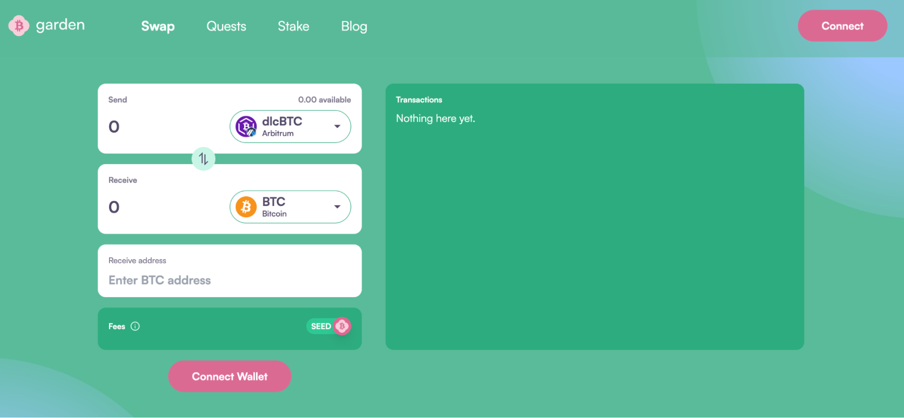
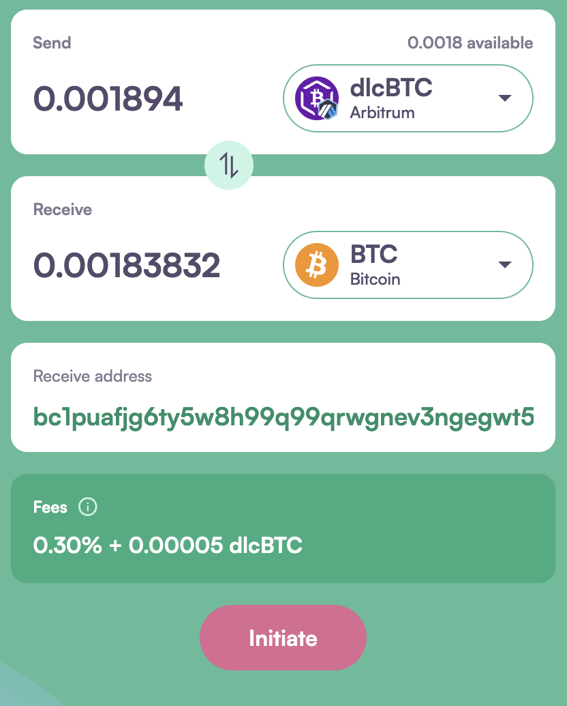
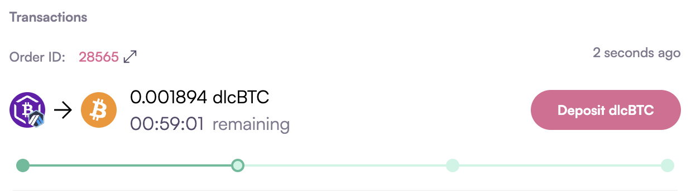
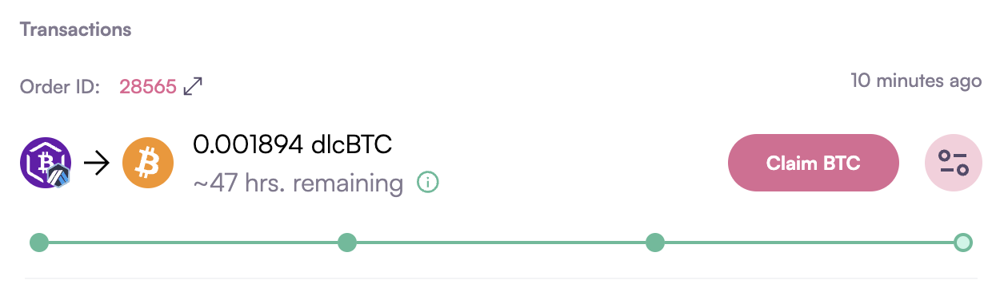

# How to swap dlcBTC to BTC

1. Go to garden.finance and click on the Swap tab, then click the “Connect” button to connect your wallet.  
   

2. Enter the amount of dlcBTC you want to swap for BTC. In the “Receive address” field, enter the Bitcoin wallet address where you wish to receive the BTC.
   

3. Hit “Initiate” and sign the transaction; you will be promoted to “Deposit dlcBTC.”  
   

4. Once you deposit dlcBTC by clicking the “Deposit dlcBTC” button, wait for order fillers to pick up the order and deposit your required BTC into an HTLC contract.
Then, claim your BTC by clicking on the "Claim BTC" button and signing the transaction. 
   

Congratulations! Your swap is done. You can check your order details by clicking on "Order ID."
