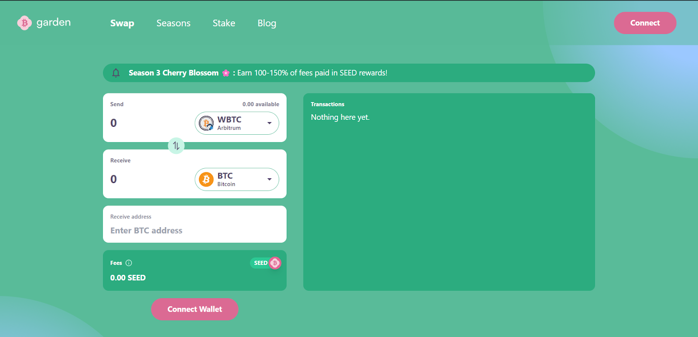
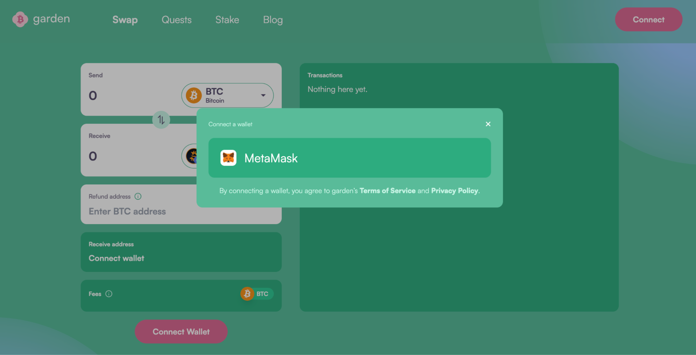
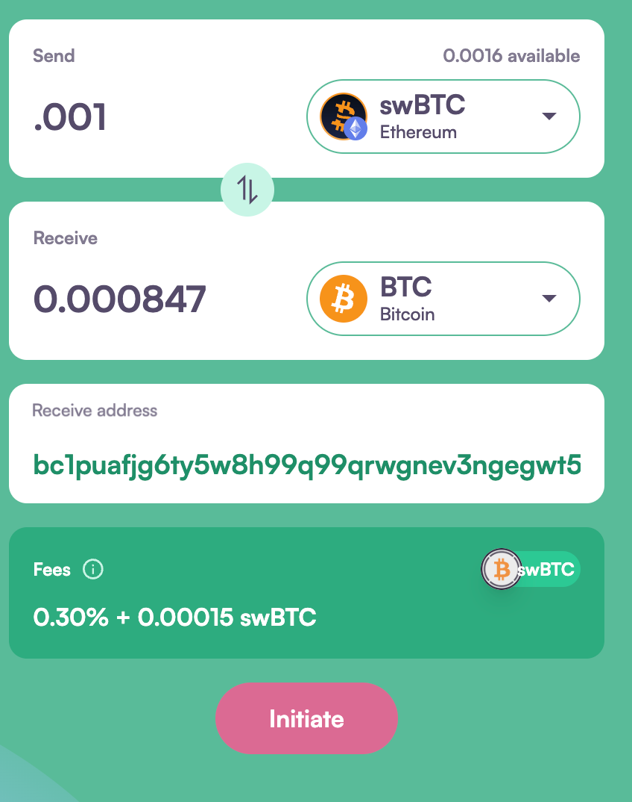
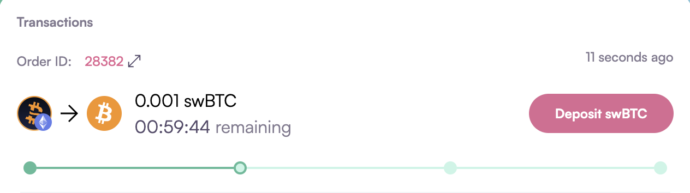
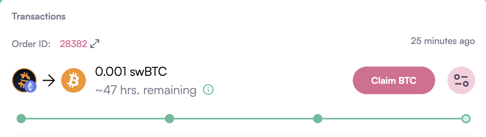

# How to swap swBTC to BTC

1. Go to garden.finance and click on the Swap tab, then click the “Connect” button in the top right corner. 
   

2. Confirm the wallet & account you want to use to perform the swap. 
   

3. Enter the amount of swBTC you want to swap for BTC, in the “Receive address” field, enter the Bitcoin  wallet address where you want to receive the BTC.
   

4. Hit “Initiate” and sign the transaction; you will be promoted to “Deposit swBTC.”  
   

5. Once you deposit swBTC by clicking the “Deposit swBTC” button, wait for order fillers to pick up the order and deposit your required BTC into an HTLC contract.
Then, claim your BTC by clicking on the "Claim BTC" button and signing the transaction. 
   

Congratulations! Your swap is done. You can check your order details by clicking on "Order ID."