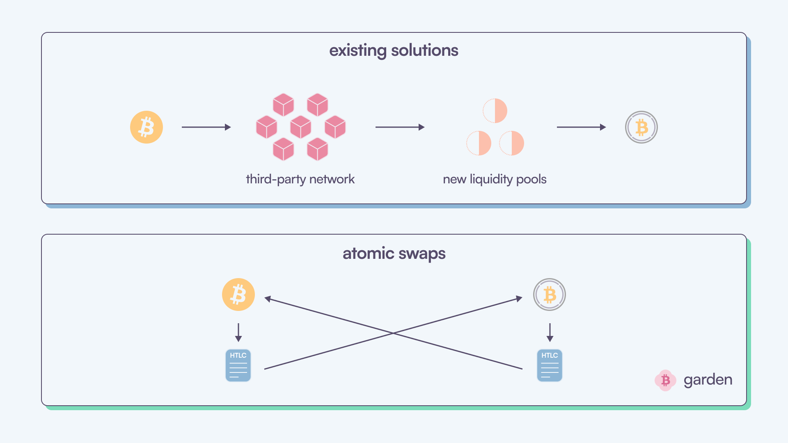

import DocCardList from '@theme/DocCardList';

# Swap

Garden is unlike traditional 'bridges' and doesn't have a custodian network or multi-sig securing the bridge. It is built using a decentralized [Order Matching Engine](/docs/home/basics/swap/OrderMatchingEngine.md) and peer-to-peer [Atomic Swaps](/docs/home/basics/swap/AtomicSwaps.md). As a result, Garden's security and decentralization are deferred to the chains on which it is deployed, making it less vulnerable to attacks.

By integrating the Garden [SDK](/docs/developers/sdk/Sdk.md), you unlock the potential to bring Bitcoin into your DeFi application, providing your users with the ability to seamlessly swap actual Bitcoin (BTC) with any asset. This integration not only enhances the user experience but also positions your application at the forefront of DeFi innovation, attracting more users who value speed, security, and cross-chain compatibility.

## New to Garden?

- [How to swap BTC to WBTC](/docs/home/basics/guides/BtcWbtc.md)
- [How to swap WBTC to BTC](/docs/home/basics/guides/WbtcBtc.md)
- [How to swap WBTC to WBTC](/docs/home/basics/guides/WbtcWbtc.md)

Garden's significant advantage is its ability to perform these swaps quickly and across different blockchains. This broad compatibility aims to enable seamless and secure Bitcoin support for various decentralized applications (dApps), expanding Bitcoin's utility and accessibility within the broader blockchain ecosystem.

<DocCardList
items={[
{
type: "link",
href: "./atomic-swaps",
label: "Atomic Swaps",
docId: "home/basics/swap/atomic-swaps",
},
{
type: "link",
href: "./order-matching-engine",
label: "Order Matching Engine",
docId: "home/basics/swap/order-matching-engine",
}
]}
/>
